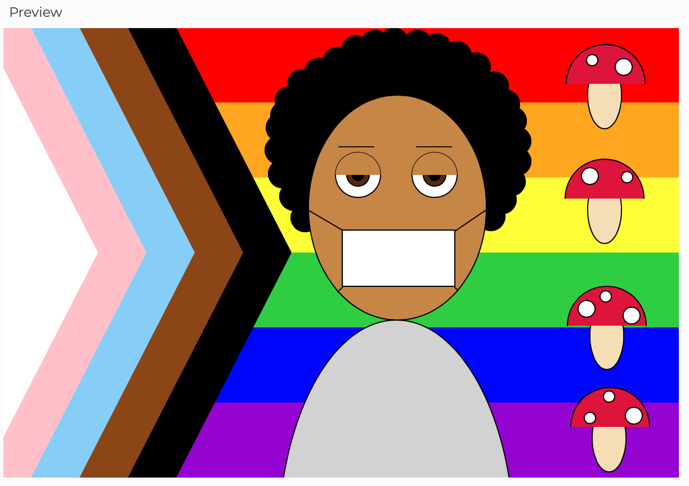

# Screenshot of Sketch

# My Experience 
- I enjoyed experimenting with the layering of shapes to create a cohesive image (for example I layered circles on top of each other for my eyes)
- I appreciated the freedom that comes with the RGB color scheme because it made it easy to come up with a skin tone that matched me
- Something interesting that I discovered when utilizing semicircular arcs was that you can vertically invert them by reversing the order of the start/stop parameters (i.e. radian(180),0 instead of 0,radian(180))
- I found the process of repeating shapes (like the mushrooms & flag stripes) extremely tedious, and I hope we will cover a way to do this more efficiently in class
- I also could not find a way to create arms, a nose and mouth, and ears without making them look weird, so I opted for a pandemic-appropriate face mask
