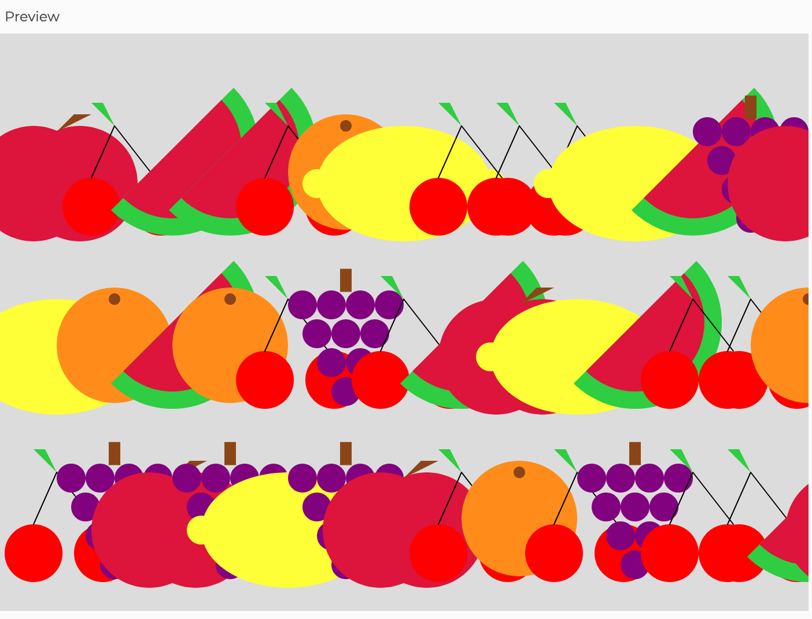

# Screenshot 

# My Process
- Upon looking at the photos meant to inspre us, I immediately thought there was no way I would be able to make something that abstract and, as Casey Reas would put it, chaotic. I briefly considered doing music notes on sheet music that would get increasingly disorganized to represent "dissonance." However, I was finally inspired to do a randomized deconstruction of the classic fruit bowl paintings many of us haveen seen before:

- Although I knew I wanted the fruits to be strewn all over the canvas in no order, which would require a loop to avoid repeatedly coding them, but I decided to use the random() function to make things more interesting. As a result, the decision of which fruit to place in each designated position was left to this function.
- Here is an early index of the fruits I wished to include with corresponding shapes required:

- There were a few difficulties I experienced:
  - While programming the watermelon function, the website would stop responding whenever I tried to randomly place seeds (points) within the radius of the ellipse; I'm unsure of whether the combined effects of the loops, conditionals and randomization required for this had anything to do with that.
  - Despite initially trying to find a mathematical solution for everything (certain distances, radii and more), I just ended choosing numbers that matched my vision for this piece; for example, although the math was accurate, some grapes were not as centered as I would have liked.
  - While using the random function to return a number that would select the fruit to be drawn, I was utterly confused when no drawings would appear. After a quick google search, I discovered this was because the random function only returns float numbers! This is also how I was introduced to the round() function which I ended up using.
  - I noticed that the fruits  requiring the layering one shape on top of the other (like the apples and lemons), looked odd this way, so I just removed the stroke for all fruits, and I feel like it makes them look for minimalistic which is nice. There were also some fruits that did not closely resemble 2D shapes (bananas, for instance) which I was forced to exclude.
  - Lastly, I tried my best to limit the configuration to a 3 x 4 table structure, but still have not figured out why the loop produces three infinite rows of fruits. In the end though, after moving the fruits closer together to add some layering, I felt like I had come full circle by adding a little bit of abstraction to an otherwise conventional piece.
