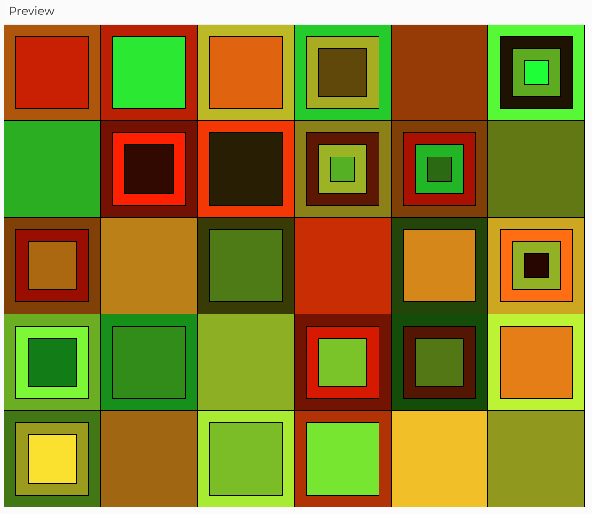
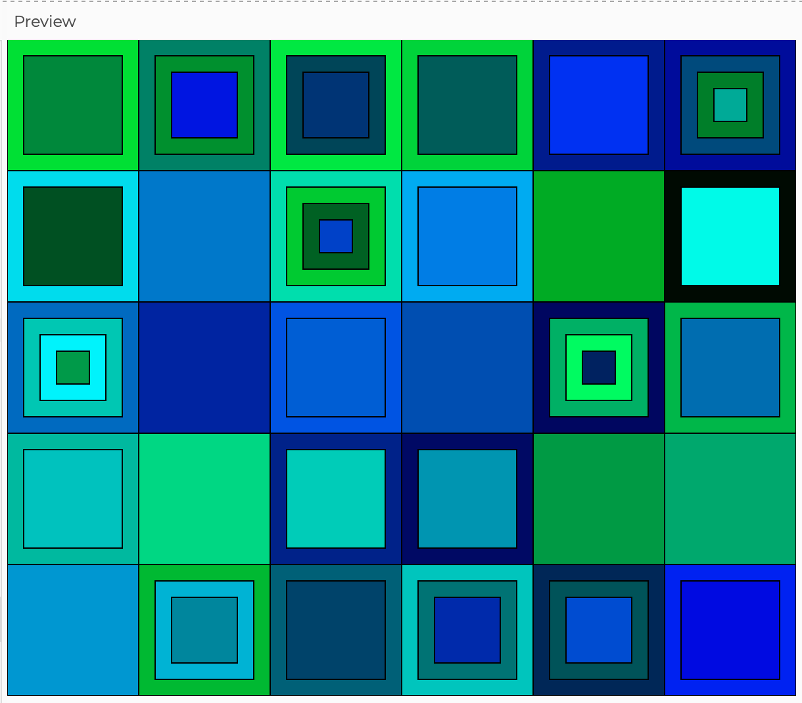

# Background
- Although I had no idea what direction to take the broad category of "generative art" in, I eventually found myself at the Louvre. There, I was inspired by their modern art section, and I used this particular painting as my inspiration:

- Although I liked the concentric circles, I decided to change them to squares, as I thought that would be more interesting due to the lack of white space between them (since each square's side is either adjacent to another square or the edges)
- I also wanted a randomized element, and I was initially going to do each set of squares with the same number of layers and have their colors generated randomly, similar to what the inspiration of this piece was like. Then I got the idea to have it be even more generative and have the computer randomly decide which sets would have one layer, which ones would have two, and so on. 
- I experimented with the `noise()` function from the assigned tutorial, but I did not like how homogenous the colors were and decided to leave it out:
, 

# Video of My Artwork
https://user-images.githubusercontent.com/98512630/153991526-4d25f78a-b884-4cc0-9295-f9a55fb1c07a.mov
