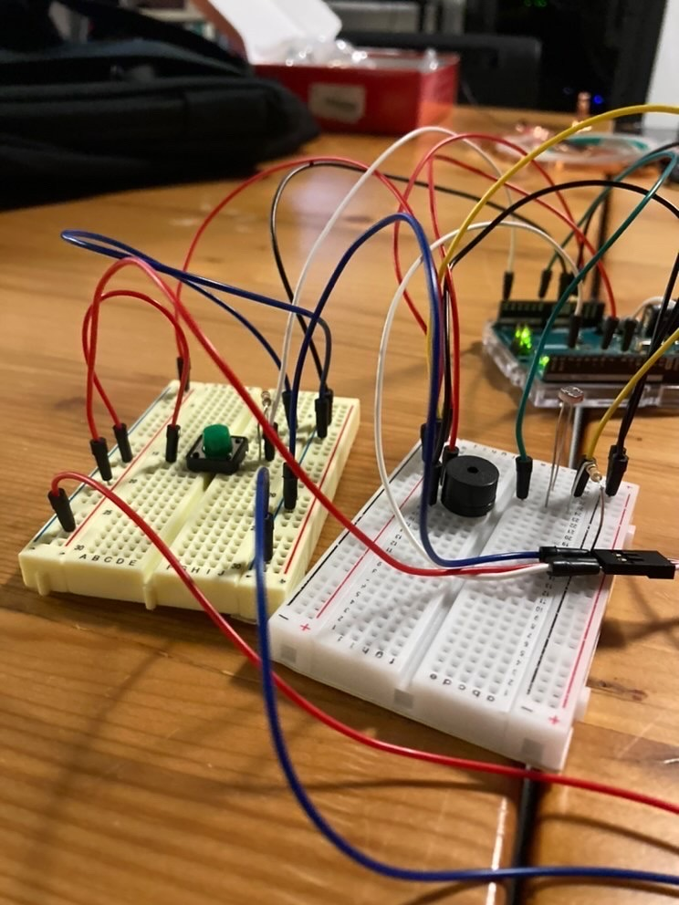
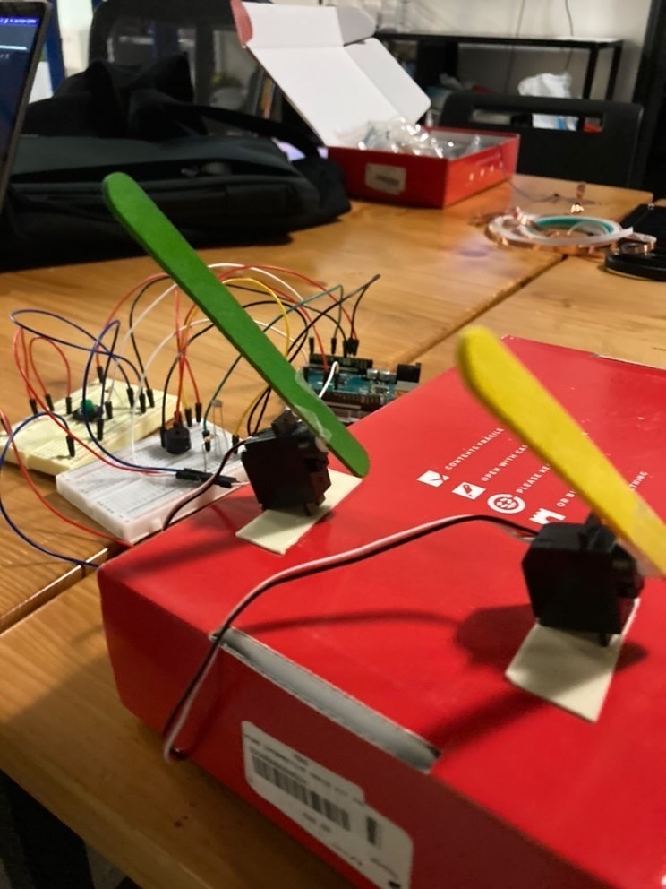
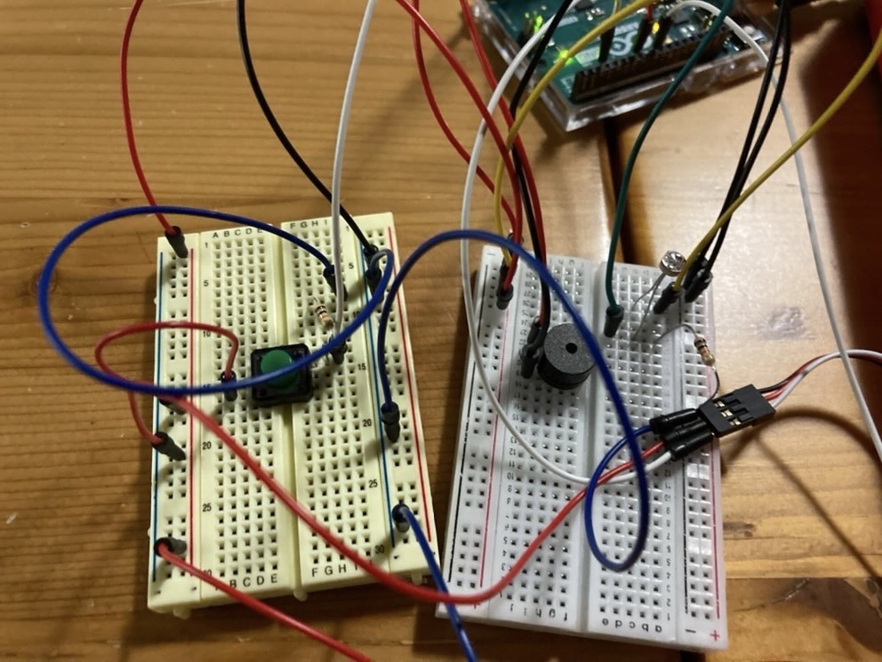
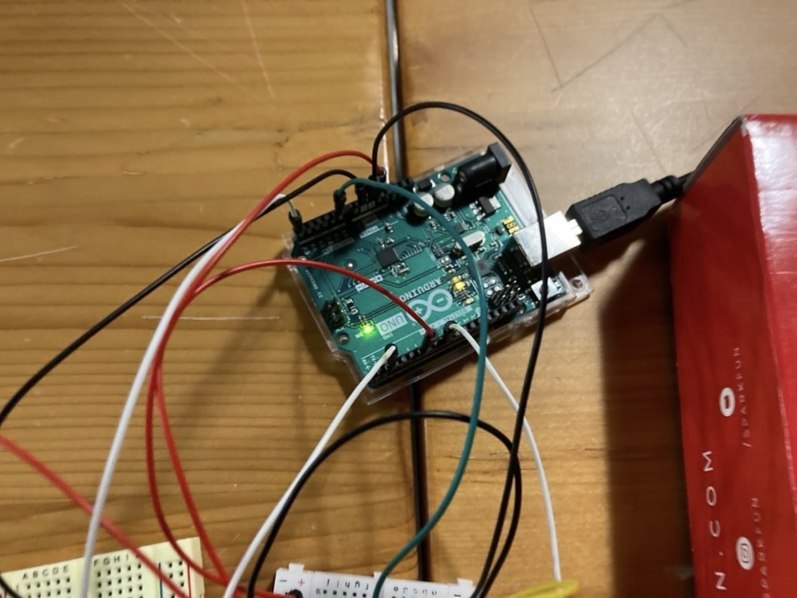

## Description
We created an instrument partly inspired by the smooth sound of a rock guitar solo and the intense beat of bass drums. When the push button is held, the popsicle sticks hit the box one after another similar to drumsticks hitting a drum, otherwise the sticks are stationary. When light from a phone is shined directly on the light sensor, the system produces a note whose frequency changes according to the intensity of the light it receives. Even cooler, when the push button is being held, the note produced only changes after every two hits from the sticks, leading to distinct changes in the tone and somewhat of a melody when paired with the movement of the sticks, as shown in the video.

## Development Process Overview
First, we began working on the analog sensing portion of the instrument. After building a simple circuit with the photoresistor, we observed that the normal lighting in the IM Lab resulted in a certain reading (~ 530), and we made that reading our base value, meaning that any light sensed above it should result in the notes being played. Programming this was simple using an if-then-else statement like the one we learned in class, and we also made the brightness of the light correlate to the pitch of the note by using the value of `sensorValue` as the frequency argument for the `tone()` function. 

Next, we began working on the digital sensing aspect firstly by attaching popsicle sticks to the servo motor attachment used in class and attaching the servo motor to the box in order to give it a fixed stance. We first experimented with just one servo motor to determine which angles would work best for the two positions of the sticks (essentially touching the box/not touching the box). We used the servo motor example from class for this, and once we were satisfied with the movement of one of the sticks, we set up the other one and incorporated it into the circuit. The last step was to combine these two test programs by editing them so that they worked smoothly together.

## Pictures
  
  

## Video
[Link to YouTube Video](https://youtube.com/shorts/Gc9cWefoltI?feature=share)

## Problems & Discoveries
We faced some challenges as we worked on our project:

When we switched on the servo motors, the buzzer would stop playing the tone, and would resume when the motors were switched off—i.e., both would not run simultaneously. It took us quite some time to figure out why this was happening, but when we looked at the analog input values of the photoresistor, it turned out that it would slow down a lot when the button was pressed and the motors were running. We later realized that this was caused by the `delay()` function that would run when the switch was pressed, and the tone wasn’t stopping when the switch was on but just delayed so much that it seemed to have stopped. Disclaimer: This was before we had read the Blink Without Delay article. Thus, we fixed this by making the tone run for longer, which meant that it didn’t change as rapidly as it did otherwise. But we really liked the way it sounded, so we kept it!

We also faced an issue when we initially attached the popsicle sticks to the service motors. Because each stick was attached at a slightly different position, they would not travel the same distance for a given angle. For instance, once we set the maximum angle to 160°, the yellow stick would go too far (this lifting the motor) but the green stick wouldn’t go far enough (it would not hit the box). As a result we had to reattach the sticks so they were approximately at the same starting point, but there were still noticeable differences so we ended up using different maximum values for each stick (160 and 140 degrees for the yellow and green stick, repsectively).

Another difficulty we had was getting the servo motor drums to sound loud enough. We ended up experimenting with different sticks and surfaces until we found one that was loud but also easy to put together—a popsicle stick and a hollow box worked really well.

Working on the project together was also quite rewarding—we realized that two heads are often better than one, especially when debugging. Every time we encountered a problem, we would look through each other’s parts of the circuit and the code, which often helped identify the bug easily. Bringing together our ideas to create one final piece was also a very fruitful process.

## Circuit Schematic

