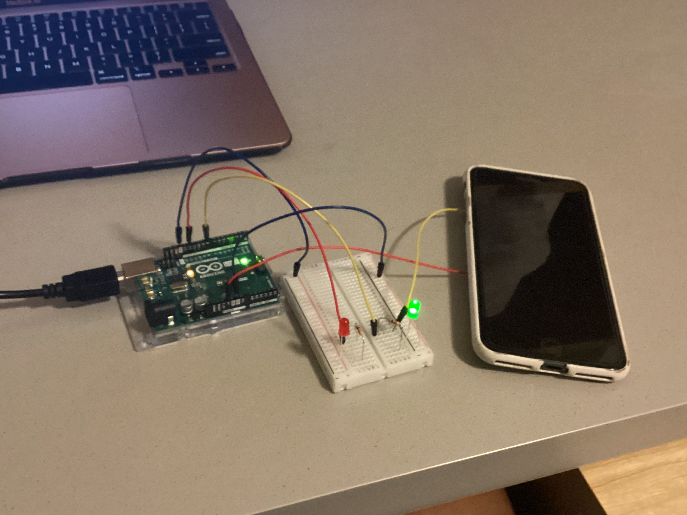
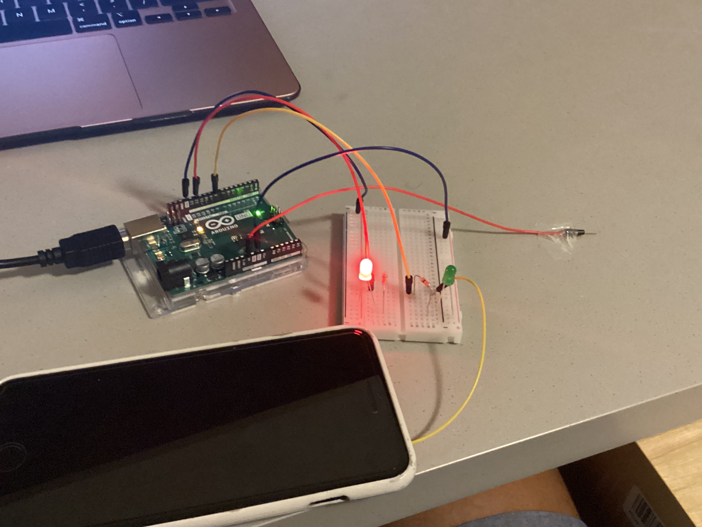

## Description
The purpose of this switch is to dissuade the user from procrastinating by scrolling through Instagram. I relied on traditional signifiers of green meaning “go” or “continue” and red meaning “stop.” When the phone is set down and the user is typing, this means they are doing their homework, which is why the green light is illuminated; this signals that they should continue doing their homework. When the user lifts the phone to start scrolling, the red light is illuminated, visually admonishing the user for procrastinating.

## Process
I created the following short program to use the green light as an input and the red light as an output. When the wire attached to the phone is connected to the green light’s power source, this means `switchStatus` is 1 or HIGH, in which case the user is studying and the green light should light up. Otherwise, `switchStatus` is 0 or LOW which means the user is procrastinating and the red light should be lit up, since the wire attached to the phone would be disconnected from the rest of the circuit (and the phone would be in the user’s hands). 

```
//Initializing the variables used to identify the pins corresponding to the two LEDs
int redLED = 12;
int greenLED = 8;

void setup() {
  // initializing the pin corresponding to the red LED as an output and the one corresponding to the green LED as an input
  pinMode(redLED, OUTPUT);
  pinMode(greenLED, INPUT);
  //Serial.begin(9600);      //I initially used the serial monitor to debug but it is not necessary for the program which is why it is commented out.
}

void loop() {
  //Initializing the variable used to store the status of the green LED (either on/HIGH or off/LOW)
  int switchStatus = digitalRead(greenLED);
  
  //Serial.print(switchStatus);   //As stated above, I used the serial monitor for debugging purposes but it is no longer needed which is why this print statement is commented out.

  //If statement that turns the red light on if the green light is off, and turns the red light off if the green light is on.
  if (switchStatus == HIGH) {
   digitalWrite(redLED, LOW); 
  } else {
    digitalWrite(redLED, HIGH);
  }
}
```

I also used double-sided tape to attach the wires to the phone and desk.

## Circuit Schematic


## Difficulties
- When the wire connected to the pin 8 was directly connected to the green LED, the red light would be lit even though the green light was on, which should not have been happening according to my program. Using the serial print function, I discovered that the input from the green LED was reading as low, despite the light glowing and the phone's wire being connected to the table's wire. Only when I moved the wire attached to the table such that it was directly connected to pin 8 (rather than direclty to the LED) did pin 8 read the status of the green LED accurately. After drawing the schematic, I realized this was likely because pin 8 was not getting any readings from the 5V when the switch was connected due to the current going straight through the LED. However, going back to the golden rule of "when in doubt, print," the serial monitor really helped me to solve this issue as it allowed me to see that pin 8 was consistently reading the green light's input as LOW or 0. Without this, I may have never considered moving the wires around.
- I also gained more appreciation for the breadboard as it was kind of hard to connect the narrow, exposed part of the wires without setting the phone down in a very precise location (as evidenced by the glitchy light blinks in my video). Although I tried to enlarge the area of conductivity by taping down the wires with copper tape, that didn't really work out. Next time, I will experiment with conductive fabric or aluminum foil and see if I get a more favorable result.

## Circuit Photos 
Connected (Left) vs. Disconnected Switch (Right) 

 
